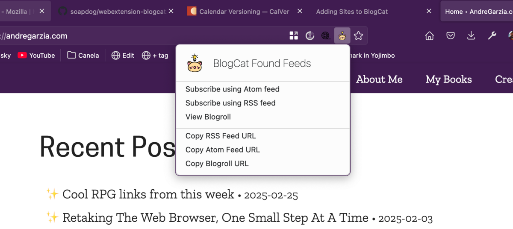

## Adding a feed while browsing

When you're browsing the Web, BlogCat will look for feeds every time you navigate to a new page. When it find one, it will display an [address bar button](https://developer.mozilla.org/en-US/docs/Mozilla/Add-ons/WebExtensions/user_interface/Page_actions) with a little cat and a lightbulb.

Clicking on it, opens a popup showing the feeds that were detected. These might include RSS, Atom and OPML blogrolls. You can click on your preferred format to open the _add feed page_ and subscribe to the website. Selecting a blogroll will open the _import OPML page_ allowing you to bulk subscribe to selected websites from the OPML file.

## Adding a feed from the browser button

BlogCat browser button also allows you to navigate to the _add feed page_ by clicking the _Add Feed_ in the popup.

## Add feed page

BlogCat will try to fetch the website title from the feed. The form will list the title (you can change it), the feed URL, and the update frequency.

The update frequency might not work exactly how you expect, I will unpack that for you shortly, just let me first say that BlogCat does not fetch feeds in the background. It only fetches feed when you open the _reader_.

- Daily: means it will fetch it no more than once every day. Basically when you open the reader, it loops through all the feeds checking when they were last accessed, if it was not today, then it fetches them again.
- Realtime: it always fetch when you open the reader (avoid using this, it is unkind to servers).
- Weekly: That doesn't mean every seven days! There are 52 weeks in a year, this one checks the _week number_ of the last time it got the feed and the current week number, if they don't match, it fetches again. That means that opening the reader on a Friday and then again on Monday will fetch the feed twice even though fewer than seven days passed.
- Monthy: Quite simple, it checks the month number, if they don't match it fetches again.

You can add one or more _tags_ to a feed by typing them in the _tags text field_ and using commas between them. The tags will become a _navigation menu_ on top of the [reader page](reader.md).

BlogCat uses [RSS Parser](https://github.com/rbren/rss-parser) to fetch feeds. This library will send [HTTP Headers](https://developer.mozilla.org/en-US/docs/Web/HTTP/Headers) to the server with the date and etag of the last time it accessed the feed and respect their response.
