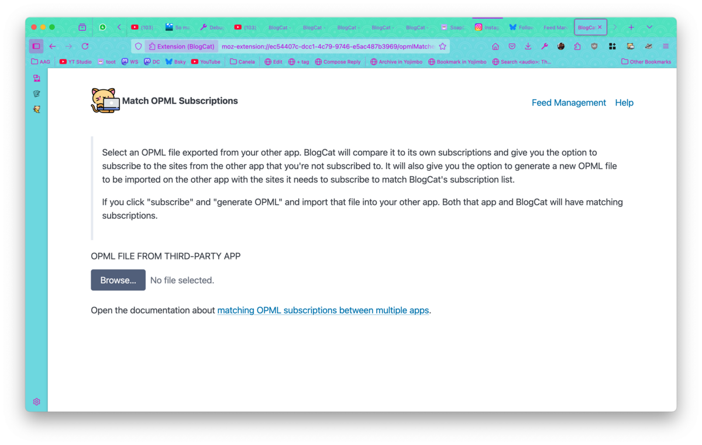
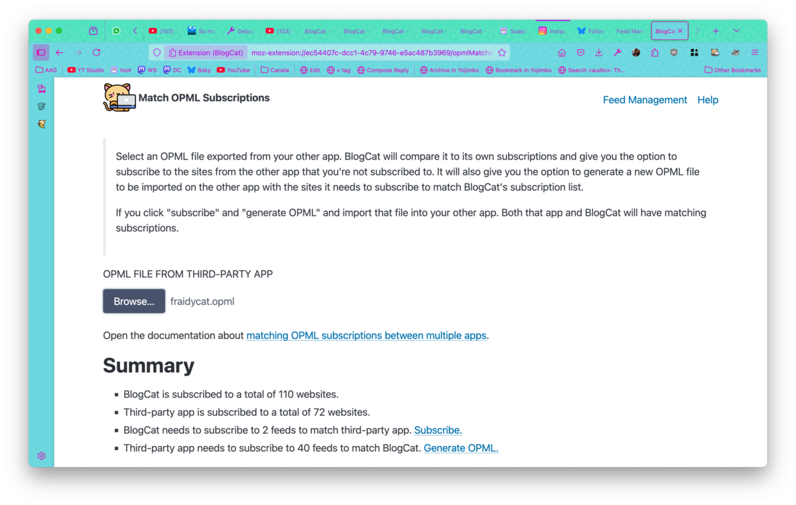

You can access the _feed management page_ using the browser toolbar button and clicking on _Manage feeds_.

## Feed management

On the feed management page, you'll see a list of all websites you're currently subscribing. On top, you'll a _navigation menu_ with all the _tags_ you have:

- _All:_ shows all the websites you subscribed to.
- _Broken Feeds:_ shows the feeds that BlogCat is having trouble loading. This might be a bug on their end or hours. In doubt, use the _browser toolbar_ to report the broken feed to me using _Issues on Github_
- _Untagged:_ websites you subscribed to but that have no tags assigned to them.
- _individual tags:_ besides the options above, BlogCat will add each tag in you have as a link there to help you find the feed you need.

You can click the website title to access the website or use the _remove button_ to unsubscribe. Clicking the _edit_ button will open the [Add Feed Page](feeddiscovery.md)

Sometimes websites get broken and BlogCat can't access their feed. Instead of trying every time, BlogCat keeps track of how many times the feed failed and will stop trying to access it after three times (you can change that value in the _add-on preferences page_).

Use the _Broken Feeds_ link a the top of the page to list what websites got broken feeds.

## Tag management

You can use the _edit_ button to go to the _Add feed page_ and edit the tags for an individual website. You can also select multiple websites using the _check boxes_ and then BlogCat will display a _bulk editing menu_ on top of the page. Use them to add, replace, or remove tags for multiple websites at the same time, change fetch frequency, or bulk removal.

## Exporting a subscription list

To export your list of subscriptions, click on _Export OPML_. This will download a `blogcat.opml` to your download folder. If you selected some feeds before clicking _Export OPML_, BlogCat will export only the selected feeds and ask you for a filename. Remember to use a _.opml_ file extension when specifying your own filename.

There are many things you can do with it:

- Add it to your blog with a `<link rel="blogroll">` such as `<link rel="blogroll" title="Blogroll" href="/.well-known/recommendations.opml">`.
- Share it with friends!
- Import it into another feed reader you like.

## Matching subscription lists with another app

You might want to use BlogCat and also another feed reader. There are many reasons for that. Maybe you want to use them on your mobile devices, or maybe sometimes you want a river-of-news paradigm. Whatever the reason, you might want to keep all your feed readers with the same subscriptions.

BlogCat has a feature to help with that. Clicking _Match Subscriptions_ will open the page to match subscriptions between BlogCat and a third-party app.

**How to match subscriptions between apps:**

- Export an OPML file with your subscriptions from your third-party app.
- Use the file input to open that file. BlogCat will display a summary of the actions needed to make both apps match:

- Clicking _Subscribe_ will make BlogCat subscribe to the websites from your other app that it was not yet following.
- Clicking _Generate OPML_ will create a file named `missing_feeds.opml` with the websites from BlogCat that your third-party app is not yet following. Import that into your other app.

Once you take both actions, the subscription between both apps will be the same.
